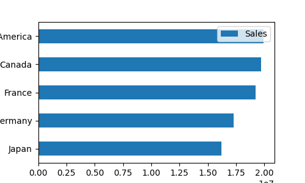

# Automating Excel Reports with Python

This project automates the process of reading sales data from multiple Excel files, aggregating the data by country, and generating a summary report with visualizations (charts). The script leverages `pandas` for data processing, `xlwings` for interacting with Excel, and `matplotlib` for generating visualizations.

## Project Overview

I am automating the process of reading, processing, and visualizing sales data from multiple Excel files. The script performs the following key tasks:

1. **Data Collection**: It processes `.xlsx` files from the `reports/raw` directory, extracts data from the "Overview" sheet in each file, and appends it to a summary workbook.
2. **Data Aggregation**: The sales data is grouped by country, and the total sales are calculated for each country.
3. **Visualization**: A stacked bar chart and a horizontal bar chart (using `matplotlib`) are generated to visualize the aggregated sales data.
4. **Final Report Generation**: A summary report is created and saved as `summary.xlsx` in the `reports/` directory, containing the aggregated data and charts.

## Requirements

Before we start, ensure that we have the following installed:

- **Python 3.x**
- **pandas**: Used for data manipulation.
- **xlwings**: Used for interacting with Excel.
- **matplotlib**: Used for generating charts.

## How It Works

### 1. Reading Data from Excel Files
The script processes all `.xlsx` files in the `reports/raw` directory. It opens each file, reads the "Overview" sheet starting from cell `B5`, and copies the data to the summary workbook.

### 2. Setting the Header Row
Once the data is copied, a header row is added in the summary workbook. This header contains the following fields:

- Segment
- Country
- Product
- Discount Band
- Units Sold
- Sale Price
- Gross Sales
- Discounts
- Sales
- COGS
- Profit

The header is also formatted with bold text and a background color.

### 3. Aggregating Data by Country
The script uses `pandas` to group the data by country and calculates the total sales for each country. This aggregated data is placed into a new column in the summary workbook.

### 4. Creating Charts
The script creates a stacked bar chart within Excel to visualize the sales data. Additionally, a horizontal bar chart is generated using `matplotlib` and saved as an image, which is then inserted into the summary sheet.

### 5. Saving the Report
After processing and generating the charts, the summary workbook is saved to the `reports/` directory as `summary.xlsx`. The script then closes the workbook, and if it's the only workbook open, it quits the Excel application.

## Input and Output Directories

### Input Directory
The script processes all `.xlsx` files from the `reports/raw` directory.

**Example Directory Structure:**
/reports/raw

### Output Directory
The script generates a `summary.xlsx` file and saves it in the `reports/` directory.

